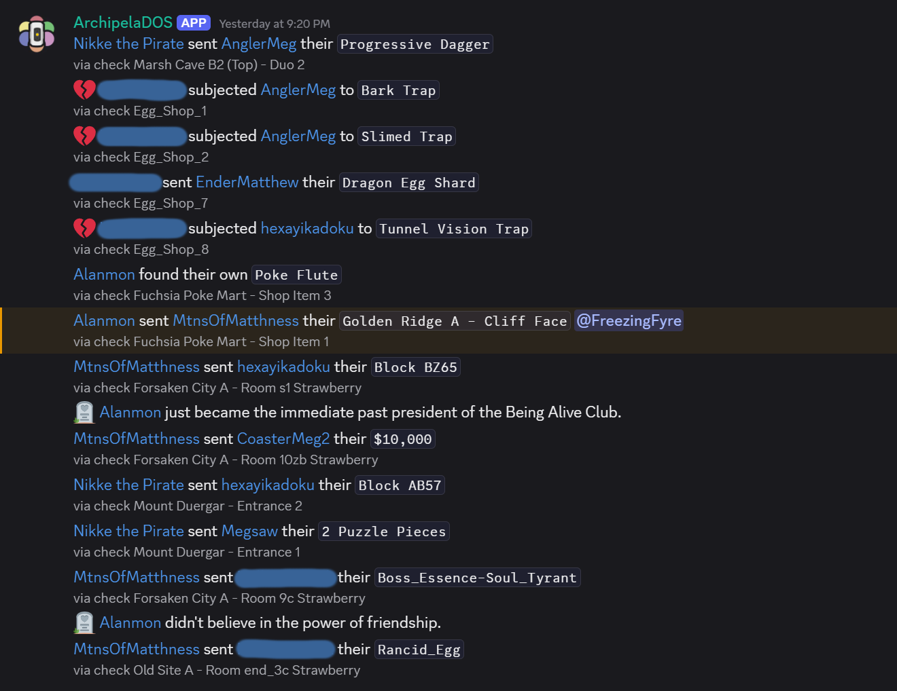
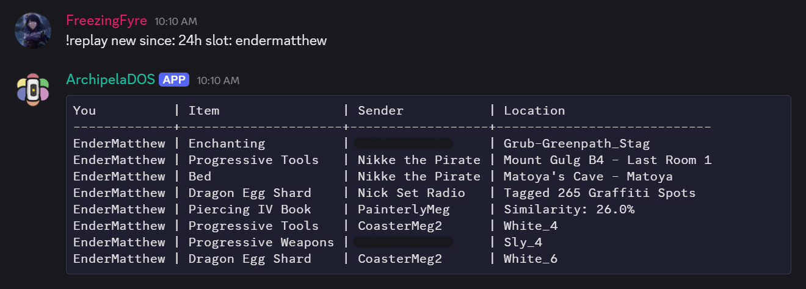
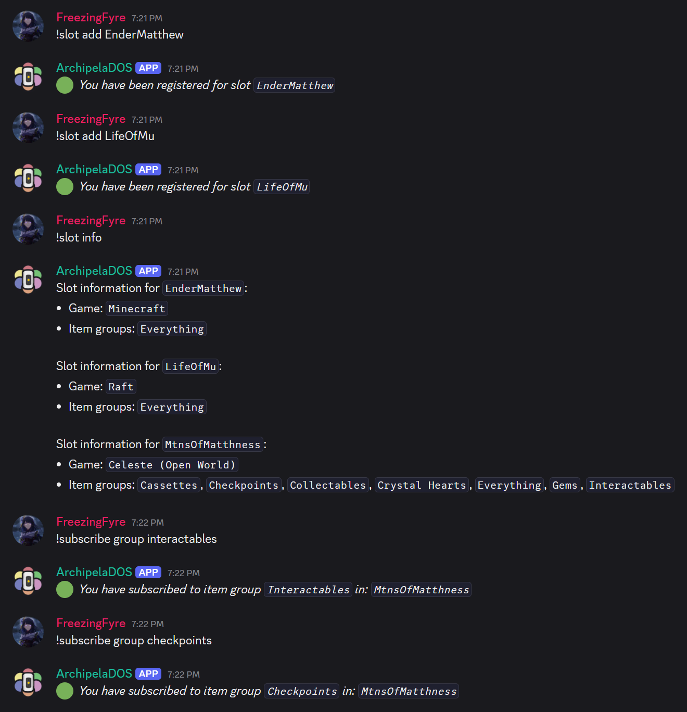
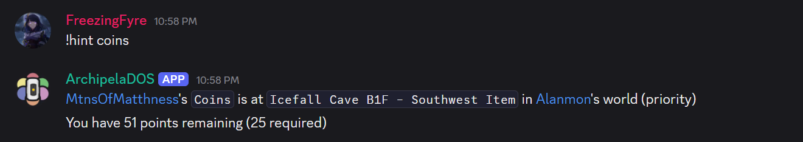
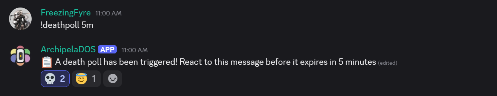
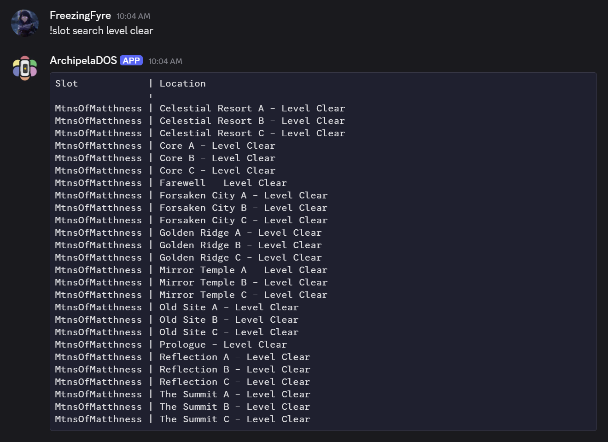
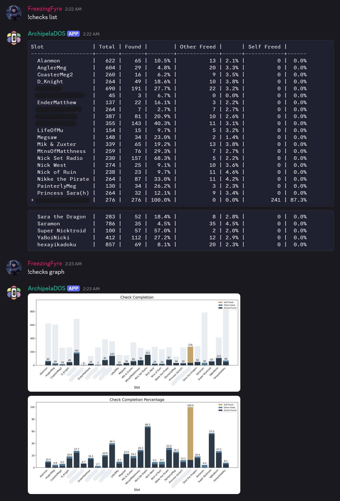
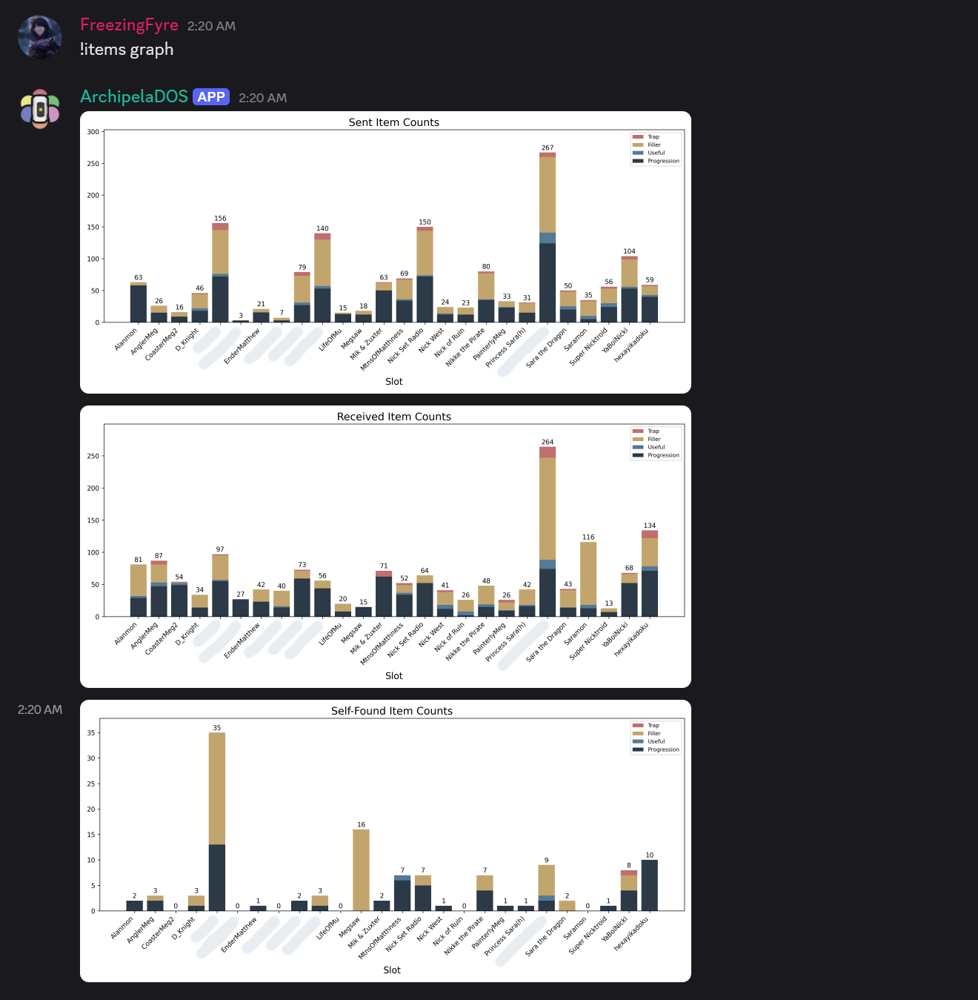

    

# ArchipelaDOS

This is a Discord bot that connects a Discord server to an [Archipelago multiworld](https://archipelago.gg/). It provides two main avenues of functionality:

- Facilitates user interaction with the multiworld through Discord commands
- Broadcasts information from the multiworld to a Discord channel (or channels), subject to configuration

For example, you could configure ArchipelaDOS to forward all death link notifications to a particular channel, so you can publicly shame your friends. Or you could forward all notifications of items being sent, to make that information more readily available. Users can subscribe for direct notifications when specific items are sent, and can see a history of all items sent.

This project was heavily inspired by [bridgeipelago](https://github.com/Quasky/bridgeipelago). I developed ArchipelaDOS out of personal passion, and to expand on the ideas of bridgeipelago with features that my friend group wanted.

### Table of Contents

- [**Setup Guide**](docs/setup_guide.md)
- [**Discord Commands**](docs/discord_commands.md)
- [**Broadcasting**](docs/broadcasting.md)

### Gallery

    <b>Broadcasting</b> 
    

    <b>User commands</b> 
    
    
    
    
    

    <b>Statistics</b> 
    
    

